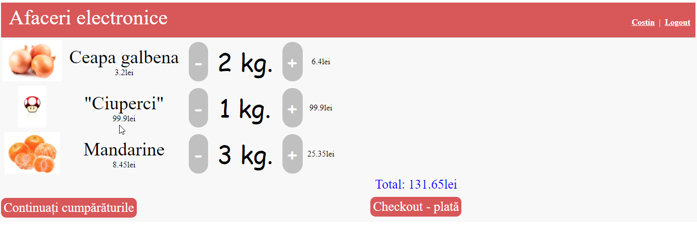

# Exemplu - proiect Spring + JSP + Spring Security + Vanilla JDBC

> Aplicație cu rol de demonstrare a componentelor unui magazin online.

Aplicatia este scrisă în Java folosind Spring MVC.

* Pentru partea de backend s-a folosit Hibernate.    
* Baza de date utilizată este PosgreSQL. Poate rula dintr-un container Docker folosind : `docker run -d --name postgres1 -p 5432:5432 -e POSTGRES_PASSWORD=mysecretpassword postgres`. Pentru crearea și popularea bazei de date se pot folosi script-urile din directorul **./sql**   
* Pentru frontend (server-side) s-a folosit tehnologia Java Server Pages.  
* Aplicația rulează folosind un server Tomcat.

Capturi de ecran:

